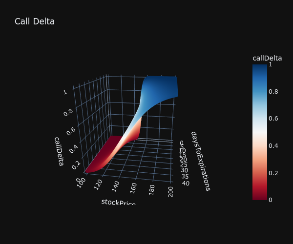

# 3d Plots of Options Greeks.
Some pleasing customizable 3d plots in Jupyter.

# Overview
This notebook will allow 3d plotting of greeks over a range of underlying prices and days to maturity.
The plots are three dimensional interactive with pop ups. Here is an example. 




# Settings
You can just run the cells in the notebook at their default settings to start. 

The `get_all_greeks` function will create a dataframe with all the greeks calculated over a 
2D array of prices and time to maturity. Here are the parameters and defaults. 

    stock_low : float 
        Lowest underlying price in the price range.
    stock_high : float 
        Highest underlying price in the price range.
    strike : float
        Strike price of the option.
    stock_increments : float
        This is the increments in the price range. A lower increment results in 
        more price points and a better graph, but longer compute time. 
    max_days : int
        Number of days away from maturity to consider. 
    """

    stock_low=100
    stock_high=200 
    strike =150
    stock_increments = .25 
    max_days=40


To select a plot to display, use the index numbers below. 
1 - Put Price
2 - Call Delta
3 - Put Delta
4 - Call Delta 2
5 - Put Delta 2
6 - Call Theta
7 - Put Theta
8 - Call Rho
9 - Put Rho
10 - Vega
11 - Gamma

# Intallation
Install using the requirements.txt document. 
```pip freeze > requirements.txt```

Alteranatively add the following packages using pip.
1. pandas
2. scipy
3. mibian
4. plotly
5. dash
6. jupyter-dash
7. nbformat